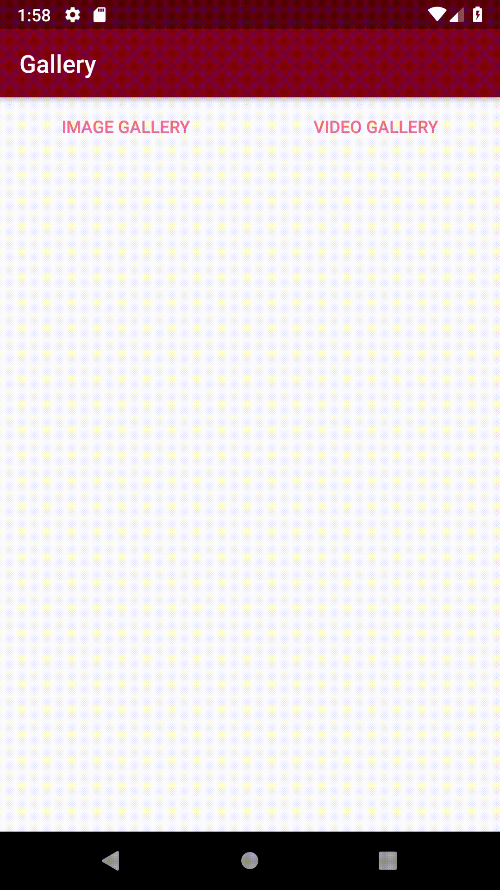

Android Gallery Sample
===================================

This sample shows you how to create a custom gallery. You can select photo / video folders and files. You can then get the selected URI.

Introduction
------------

This project is a simple sample that allows developers to create custom galleries.
The GalleryManager.java file contains code to get the album and get the files in that album.

The file preview uses the Glide library and shows the images side by side using the flexbox library.

This sample requires external storage permission.

Screenshots
-------------

  

Reference
-------

- Glide: https://github.com/bumptech/glide
- flexbox-layout: https://github.com/google/flexbox-layout
